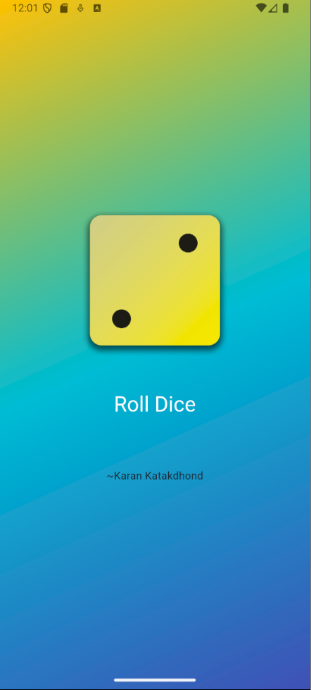

# 🎲 Dice Roller App (Flutter)

A simple Flutter app that simulates rolling a dice. Press the roll button, and the app will display a random dice face between 1 and 6. Great for beginners learning Flutter, state management, and UI updates!

---

## 📱 Screenshots

<p align="center">
  Home Screen
  
</p>


---

## 🚀 Features

- 🎲 Displays a random dice image (1 to 6)
- 📱 Clean and responsive UI
- 🔁 One-tap re-roll functionality
- 💡 Beginner-friendly Flutter concepts

---

## 🛠️ Built With

- [Flutter](https://flutter.dev/)
- Dart
- Stateful Widgets
- Random package (`dart:math`)

---

## 📦 Getting Started

### ✅ Prerequisites
- Flutter SDK installed
- Android Studio, VS Code, or any preferred IDE
- Emulator or physical device

### ▶️ Run Locally


```bash
git clone https://github.com/your-username/dice-roller.git
cd dice-roller
flutter pub get
flutter run
lib/
  └── main.dart       # Main app file
assets/
  └── dice1.png       # Dice images from 1 to 6
  └── ...
